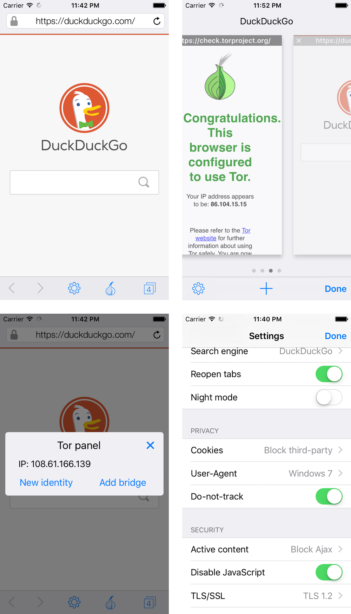

	
	<h1 align="center">Tob</h1>

Tob is a free, open-source and ad-less web browser that uses Tor to protect your privacy.

Features:
- Anonymously browse the internet without websites knowing your real IP address.
- Navigate the internet without your ISP tracking you.
- Access .onion websites ("hidden services" only available with Tor)
- Change IP address, clear cookies and cache with the press of a button.
- Disable scripts that could be used to track your network activity.

NOTE:
Web browsing is slower than through a normal web browser due to relaying through the Tor anonymization network.

